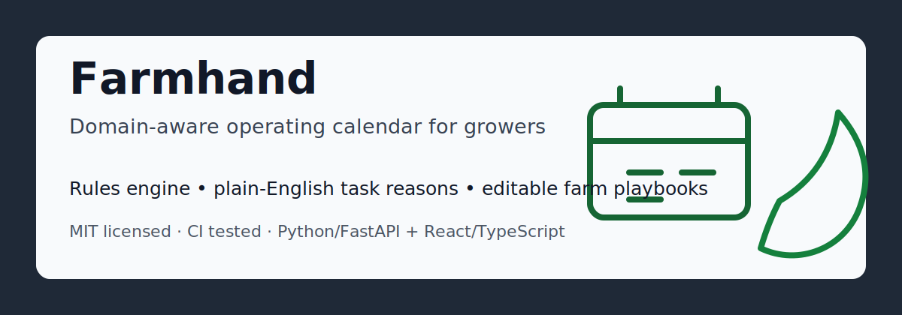

# Farmhand

[](https://github.com/primitive-0rigins/farmhand/actions/workflows/ci.yml)
[](LICENSE)


Farmhand is a daily farm operating calendar.

It tells a farmer what to do today, what to watch for, and what changed because
of weather, season, zone, crops, pests, disease pressure, and the farm's own
equipment and playbooks.



## Why This Matters

Farmhand shows product and domain modeling: deterministic planning rules first, AI later.
The useful part is not that it is farm-specific; it is that real operating constraints shape
the data model, task reasons, and reusable playbook workflow.

## Quick Demo

```bash
git clone https://github.com/primitive-0rigins/farmhand.git
cd farmhand

cd backend
python3 -m venv .venv
.venv/bin/python -m pip install -e '.[dev]'
.venv/bin/python -m pytest

cd ../frontend
npm install
npm run build
```

## Product Promise

Farmhand is not a generic calendar. It is a farm-aware task system.

Example:

- A user creates a farm in Greenville, SC, zone 8b.
- They add a greenhouse, tomatoes, peppers, irrigation, and a tractor.
- Tomorrow has a thunderstorm risk.
- Farmhand creates a task: "Secure greenhouse before storms."
- The farmer edits it to: "Secure greenhouse, latch sidewalls, cover tractor,
  and move seed trays off low benches."
- That edited playbook becomes their default bad-weather prep task going
  forward.

## Stack

- Backend: Python, FastAPI
- Database: Postgres
- Frontend: React, TypeScript, Vite
- Job runner, later: Arq, Celery, or RQ
- Weather source, first: NOAA/NWS where available

## Repository Layout

```text
farmhand/
  backend/
    app/
      domain/        # deterministic farm rules and planning logic
    tests/
  frontend/
    src/
  docs/
    ROADMAP.md
  docker-compose.yml
```

## First Principles

- Farmers should see what matters in under 20 seconds.
- Every generated task needs a plain-English reason.
- Generated tasks are editable into reusable farm playbooks.
- Rules are deterministic first. AI can come later as an assistant layer.
- Location, planting zone, farm assets, and crops drive the calendar.

## Local Development

Backend tests currently exercise demo API and domain logic and do not require Postgres.

```bash
cd backend
.venv/bin/python -m uvicorn app.main:app --host 127.0.0.1 --port 8000
```

```bash
cd frontend
npm run dev -- --host 127.0.0.1
```

The frontend reads `VITE_API_BASE_URL`, defaulting to `http://localhost:8000`.
The backend reads `FARMHAND_ALLOWED_ORIGINS`, defaulting to local Vite origins.
Use `.env.example` as the public-safe template.

## Public Repo Safety

- Keep demo farms city-level and public-safe.
- Do not commit real farm addresses, customer data, API keys, tokens, logs, or `.env` files.
- Keep deployed CORS origins explicit with `FARMHAND_ALLOWED_ORIGINS`.
- See `SECURITY.md` before adding persistence, accounts, weather providers, or AI providers.
